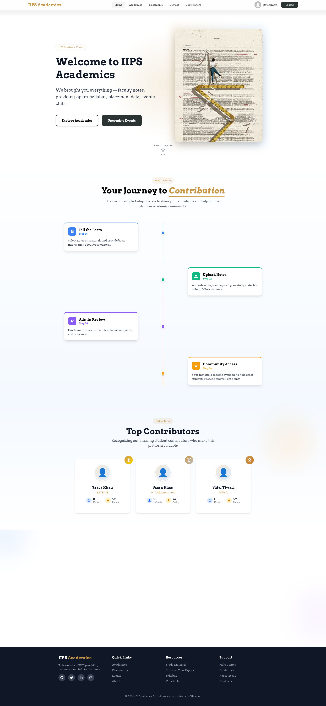
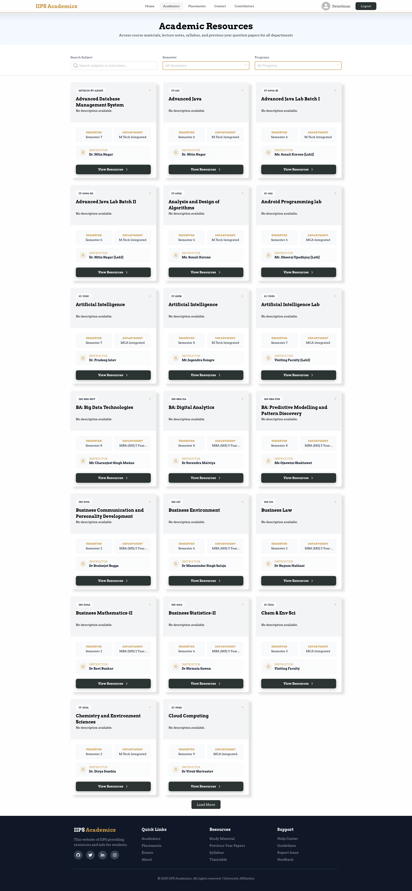
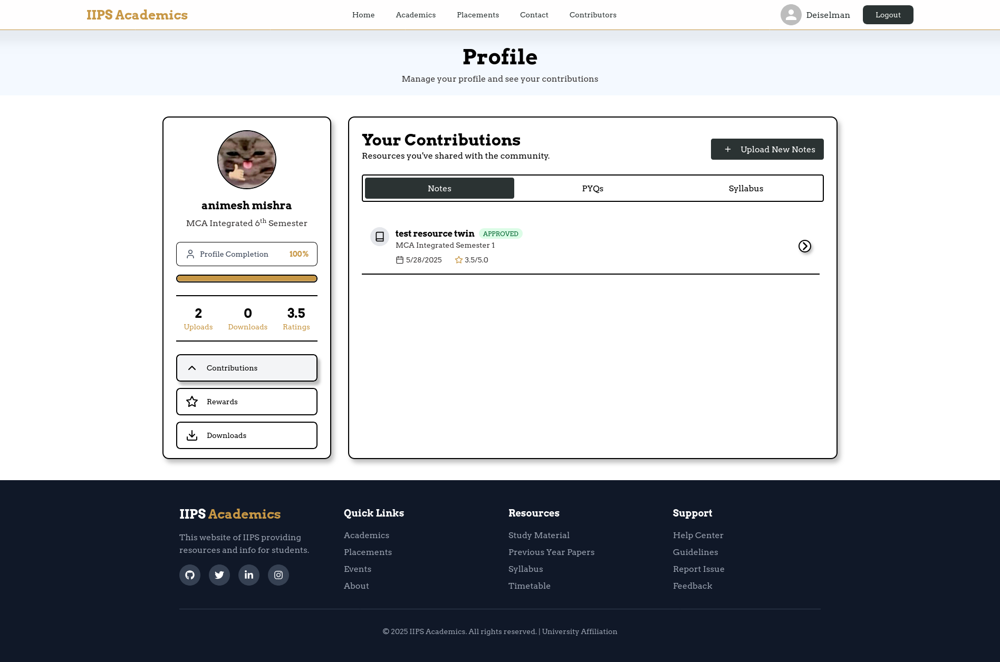

# IIPS Academics 2.0

A modern academic portal for IIPS students and faculty, built with a Vite + React frontend and a Supabase backend. The platform enables resource sharing, student contributions, and streamlined academic management.

---

## Table of Contents
- [Features](#features)
- [Project Structure](#project-structure)
- [Getting Started](#getting-started)
- [Backend Setup](#backend-setup)
- [Frontend Setup](#frontend-setup)
- [Contributing](#contributing)
- [Team](#team)
- [License](#license)

---

## Features
- Student and faculty authentication (Email, Google, GitHub)
- Upload, review, and download academic resources (Notes, PYQs, Syllabus)
- Admin dashboard for resource moderation
- Rewards and leaderboard for top contributors
- Responsive, modern UI with Tailwind CSS
- Supabase as BaaS: database, authentication, triggers, and RLS

## Project Structure
```
IIPS_Academics_2.0/
├── backend/           # Supabase SQL migrations and backend config
├── frontend/          # Vite + React frontend
├── supabase/          # Supabase Edge Functions
└── package.json       # Root dependencies (if any)
```

## Getting Started

### Prerequisites
- Node.js (v18+ recommended)
- npm or yarn
- Supabase account ([supabase.com](https://supabase.com/))

---

## Backend Setup
1. **Create a Supabase Project**
   - Go to [supabase.com](https://supabase.com/) and create a new project.
   - Get your Project URL and Anon Key from the API settings.

3. **Configure Authentication Providers**
   - Enable Email, Google, and GitHub providers in Supabase Auth settings.
   - Set redirect URIs and site URLs as described in `backend/README.md`.

---

## Frontend Setup
1. **Install dependencies**
   ```fish
   cd frontend
   npm install
   ```
2. **Configure Environment Variables**
   - Create a `.env` file in `frontend/`:
     ```env
     VITE_SUPABASE_URL=your_supabase_url
     VITE_SUPABASE_ANON_KEY=your_anon_key
     ```
3. **Run the development server**
   ```fish
   npm run dev
   ```
   The app will be available at `http://localhost:5173` by default.

---

## Contributing
We welcome contributions! To get started:
1. Fork this repository and clone your fork.
2. Create a new branch for your feature or bugfix.
3. Make your changes and commit with clear messages.
4. Push to your fork and open a Pull Request.

**Contribution Guidelines:**
- Follow the existing code style (see ESLint and Prettier configs).
- For major changes, open an issue first to discuss your proposal.
- Add tests or documentation as needed.
- Be respectful and constructive in code reviews.

---


## Screenshots

| Homepage | Academics Page | Profile Page |
|---|---|---|
|  |  |  |

---

## How to Contribute Resources (Notes, PYQs, Syllabus)

1. **Complete Your Profile**
   - Ensure your profile is complete (course, semester, etc.) before uploading.

2. **Open the Upload Modal**
   - Go to the "Contributions" section in your dashboard.
   - Click the “Upload New Note/PYQ/Syllabus” button.

3. **Fill in Resource Details**
   - **Title:** Enter a clear, descriptive title.
   - **Resource Type:** Select Note, PYQ, or Syllabus.
   - **Course/Department:** Choose the relevant course.
   - **Semester:** Select the semester.
   - **Subject:** Pick the subject from the dropdown.
   - **Description:** (Optional) Add extra details about the resource.

4. **Upload the File**
   - Only PDF files are accepted (max size: 5MB).
   - Select your PDF file to upload.

5. **Submit**
   - Click “Upload Resource.”
   - Your file will be uploaded and marked as “Pending” for admin review.

6. **Admin Review**
   - Admins will review your submission.
   - You’ll be notified if your resource is approved or rejected (with reason).

7. **Earn Rewards**
   - Approved resources earn you reward points and help your peers!

**Upload Guidelines:**
- Only upload original or permitted content.
- Ensure your file is clear and legible.
- Use descriptive titles and fill all required fields.

---

## Open Source Contribution Instructions

We welcome open source contributions! To contribute to this project:

1. **Star and Fork the Repository**
   - Click the “Star” button if you like the project.
   - Fork the repository to your own GitHub account.

2. **Clone Your Fork**
   - Clone your forked repository to your local machine.

3. **Create a New Branch**
   - Use a descriptive branch name (e.g., `feature/resource-preview`, `fix/login-bug`).

4. **Make Your Changes**
   - Follow the existing code style and best practices.
   - Add or update documentation and tests as needed.

5. **Commit and Push**
   - Write clear, concise commit messages.
   - Push your branch to your fork.

6. **Open an Issue (Optional but Recommended)**
   - For major changes or new features, open an issue to discuss your proposal before starting work.

7. **Raise a Pull Request (PR)**
   - Go to the original repository and open a Pull Request from your branch.
   - Clearly describe your changes and reference any related issues.

8. **Participate in Code Review**
   - Respond to feedback and make any requested changes.

9. **Celebrate!**
   - Your contribution will be reviewed and merged if it meets the guidelines.

**Tips:**
- Be respectful and constructive in all discussions.
- Check for existing issues/PRs before starting work.
- If you’re new to open source, check out [How to Create a Pull Request](https://opensource.guide/how-to-contribute/#opening-a-pull-request).

---